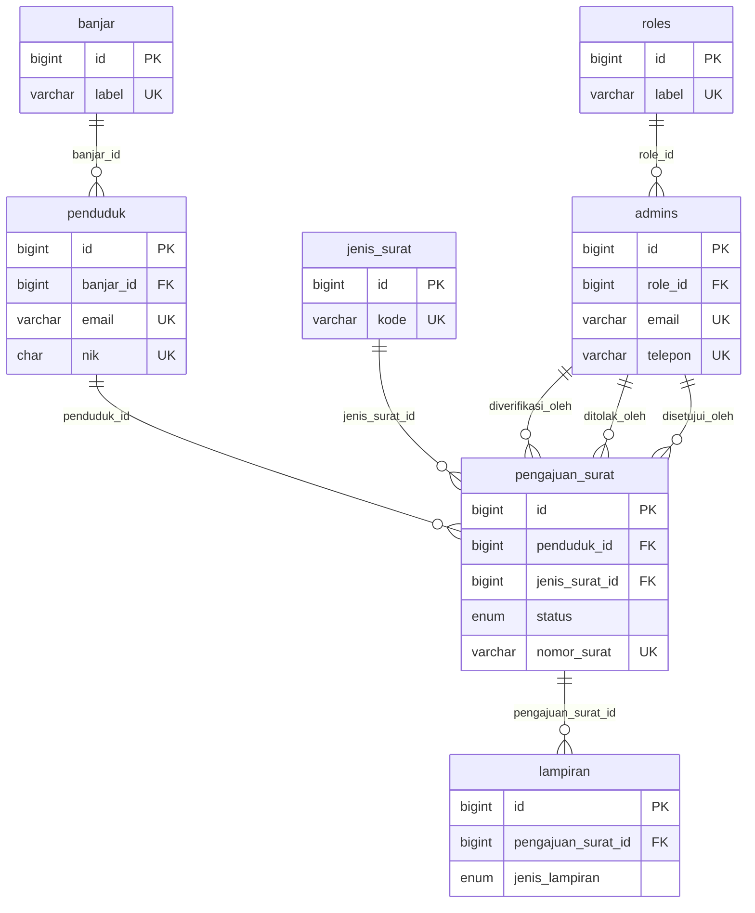

# SIPEMAS — Database Schema

**Sistem Informasi Pelayanan Masyarakat Prebekel Desa Adat Mengwi**

Dokumen ini menggambarkan skema database SIPEMAS **terkini**, disusun langsung dari file migration di `database/migrations`. Mencakup tipe data, atribut lengkap (nullable, default, unique, index), foreign key beserta perilaku `ON DELETE`, dan relasi Eloquent antar model.

- **DBMS**: MySQL (InnoDB, `utf8mb4`)
- **Framework**: Laravel
- **Sumber**: `0001_01_01_000000_create_users_table.php`, `2026_09_07_212757_create_surat_table.php`
- **Nama database (dev)**: `sipemas_mengwi_app`

> Catatan: file migration bernama `create_users_table`, tetapi di dalamnya **tidak ada tabel `users`**. Yang dibuat: `roles`, `banjar`, `admins`, `penduduk` (dan `sessions` bawaan Laravel). Autentikasi memakai dua model terpisah — `Admin` (guard `system`) dan `Penduduk` (guard `portal`).

---

## 1. Ringkasan Tabel

| # | Tabel | Fungsi | Jumlah Kolom |
|---|---|---|---|
| 1 | `roles` | Master role internal (Perbekel, Sekretaris, Staf) | 4 |
| 2 | `banjar` | Master wilayah/banjar | 4 |
| 3 | `admins` | Akun pengguna internal desa (guard `system`) | 10 |
| 4 | `penduduk` | Akun masyarakat (guard `portal`) + data kependudukan | 17 |
| 5 | `jenis_surat` | Master 3 jenis surat layanan | 5 |
| 6 | `pengajuan_surat` | Transaksi pengajuan surat | 20 |
| 7 | `lampiran` | File lampiran per pengajuan (KTP/KK) | 6 |
| 8 | `sessions` | Penyimpanan sesi bawaan Laravel (bukan domain bisnis) | 6 |

---

## 2. ERD

---

## 3. Detail Tabel

Keterangan kolom **Key**:
`PK` = primary key, `FK` = foreign key, `UK` = unique, `IDX` = index.

### 3.1 `roles`

| Kolom | Tipe | Nullable | Default | Key | Keterangan |
|---|---|---|---|---|---|
| `id` | `bigint unsigned` | ❌ | auto increment | PK | |
| `label` | `varchar(100)` | ❌ | — | UK | Nilai: `Perbekel`, `Sekretaris`, `Staf` (enum `App\Enums\Role`) |
| `created_at` | `timestamp` | ✅ | NULL | | |
| `updated_at` | `timestamp` | ✅ | NULL | | |

### 3.2 `banjar`

| Kolom | Tipe | Nullable | Default | Key | Keterangan |
|---|---|---|---|---|---|
| `id` | `bigint unsigned` | ❌ | auto increment | PK | |
| `label` | `varchar(100)` | ❌ | — | UK | Nama banjar, mis. `Banjar Serangan` |
| `created_at` | `timestamp` | ✅ | NULL | | |
| `updated_at` | `timestamp` | ✅ | NULL | | |

### 3.3 `admins`

Akun internal (Prebekel / Sekretaris / Staf).

| Kolom | Tipe | Nullable | Default | Key | Keterangan |
|---|---|---|---|---|---|
| `id` | `bigint unsigned` | ❌ | auto increment | PK | |
| `role_id` | `bigint unsigned` | ✅ | NULL | FK → `roles.id` | `ON DELETE SET NULL` |
| `nama` | `varchar(255)` | ❌ | — | | |
| `email` | `varchar(255)` | ❌ | — | UK | Dipakai untuk login guard `system` |
| `telepon` | `varchar(20)` | ✅ | NULL | UK | |
| `password` | `varchar(255)` | ❌ | — | | Cast `hashed` (bcrypt otomatis) |
| `is_active` | `tinyint(1)` | ❌ | `1` | | Cast `boolean` |
| `remember_token` | `varchar(100)` | ✅ | NULL | | Bawaan Laravel |
| `created_at` | `timestamp` | ✅ | NULL | | |
| `updated_at` | `timestamp` | ✅ | NULL | | |

### 3.4 `penduduk`

Akun masyarakat + data kependudukan (dipakai untuk auto-fill form pengajuan).

| Kolom | Tipe | Nullable | Default | Key | Keterangan |
|---|---|---|---|---|---|
| `id` | `bigint unsigned` | ❌ | auto increment | PK | |
| `banjar_id` | `bigint unsigned` | ✅ | NULL | FK → `banjar.id` | `ON DELETE SET NULL` |
| `nama` | `varchar(255)` | ❌ | — | | |
| `email` | `varchar(255)` | ❌ | — | UK | Dipakai untuk login guard `portal` |
| `telepon` | `varchar(20)` | ✅ | NULL | UK | |
| `password` | `varchar(255)` | ❌ | — | | Cast `hashed` |
| `nik` | `char(16)` | ❌ | — | UK | 16 digit |
| `alamat` | `varchar(255)` | ❌ | — | | |
| `tempat_lahir` | `varchar(255)` | ❌ | — | | |
| `tanggal_lahir` | `date` | ❌ | — | | |
| `jenis_kelamin` | `enum('L','P')` | ❌ | — | | Enum `App\Enums\JenisKelamin` |
| `agama` | `enum('Islam','Kristen','Katolik','Hindu','Buddha','Konghucu')` | ❌ | — | | Enum `App\Enums\Agama` |
| `pekerjaan` | `varchar(255)` | ❌ | — | | |
| `is_active` | `tinyint(1)` | ❌ | `1` | | Cast `boolean` |
| `remember_token` | `varchar(100)` | ✅ | NULL | | Bawaan Laravel |
| `created_at` | `timestamp` | ✅ | NULL | | |
| `updated_at` | `timestamp` | ✅ | NULL | | |

### 3.5 `jenis_surat`

| Kolom | Tipe | Nullable | Default | Key | Keterangan |
|---|---|---|---|---|---|
| `id` | `bigint unsigned` | ❌ | auto increment | PK | |
| `kode` | `varchar(255)` | ❌ | — | UK | `SKD` (Domisili), `SKU` (Usaha), `SP` (Pengantar) |
| `label` | `varchar(255)` | ❌ | — | | Label tampil, mis. `Surat Keterangan Domisili` |
| `created_at` | `timestamp` | ✅ | NULL | | |
| `updated_at` | `timestamp` | ✅ | NULL | | |

### 3.6 `pengajuan_surat`

Tabel inti transaksi. Kolom detail diisi kondisional sesuai jenis surat.

| Kolom | Tipe | Nullable | Default | Key | Keterangan |
|---|---|---|---|---|---|
| `id` | `bigint unsigned` | ❌ | auto increment | PK | Dipakai juga sebagai **No. Tiket** di email |
| `penduduk_id` | `bigint unsigned` | ✅ | NULL | FK → `penduduk.id` | `ON DELETE SET NULL` |
| `jenis_surat_id` | `bigint unsigned` | ✅ | NULL | FK → `jenis_surat.id` | `ON DELETE SET NULL` |
| `status` | `enum('Diajukan','Diverifikasi','Selesai','Ditolak')` | ❌ | `'Diajukan'` | | Enum `App\Enums\StatusSurat` |
| `nomor_surat` | `varchar(255)` | ✅ | NULL | UK | Diisi saat status `Selesai`, format `SKD/MENGWI/001/2026` |
| `catatan` | `tinytext` | ✅ | NULL | | Catatan tambahan dari pemohon |
| `catatan_penolakan` | `text` | ✅ | NULL | | Diisi petugas saat menolak |
| `status_perkawinan` | `enum('Belum Kawin','Kawin','Cerai Hidup','Cerai Mati')` | ✅ | NULL | | Dipakai untuk jenis surat `SKD` |
| `tujuan_instansi` | `varchar(255)` | ✅ | NULL | | Dipakai untuk jenis surat `SP` |
| `keperluan` | `varchar(255)` | ✅ | NULL | | Dipakai untuk jenis surat `SP` |
| `nama_usaha` | `varchar(255)` | ✅ | NULL | | Dipakai untuk jenis surat `SKU` |
| `lokasi_usaha` | `varchar(255)` | ✅ | NULL | | Dipakai untuk jenis surat `SKU` |
| `diverifikasi_oleh` | `bigint unsigned` | ✅ | NULL | FK → `admins.id` | `ON DELETE SET NULL` — staf yang verifikasi |
| `diverifikasi_pada` | `timestamp` | ✅ | NULL | | Cast `datetime` |
| `ditolak_oleh` | `bigint unsigned` | ✅ | NULL | FK → `admins.id` | `ON DELETE SET NULL` |
| `ditolak_pada` | `timestamp` | ✅ | NULL | | Cast `datetime` |
| `disetujui_oleh` | `bigint unsigned` | ✅ | NULL | FK → `admins.id` | `ON DELETE SET NULL` — Sekretaris/Perbekel |
| `disetujui_pada` | `timestamp` | ✅ | NULL | | Cast `datetime` |
| `created_at` | `timestamp` | ✅ | NULL | | Tanggal pengajuan masuk |
| `updated_at` | `timestamp` | ✅ | NULL | | |

### 3.7 `lampiran`

| Kolom | Tipe | Nullable | Default | Key | Keterangan |
|---|---|---|---|---|---|
| `id` | `bigint unsigned` | ❌ | auto increment | PK | |
| `pengajuan_surat_id` | `bigint unsigned` | ✅ | NULL | FK → `pengajuan_surat.id` | `ON DELETE SET NULL` |
| `jenis_lampiran` | `enum('KTP','KK')` | ❌ | — | | Enum `App\Enums\JenisLampiran` |
| `file_path` | `varchar(255)` | ❌ | — | | Path relatif di disk `local`, mis. `lampiran/12/xxxx.jpg` |
| `created_at` | `timestamp` | ✅ | NULL | | |
| `updated_at` | `timestamp` | ✅ | NULL | | |

### 3.8 `sessions`

Bawaan Laravel, tidak dipakai untuk data bisnis.

| Kolom | Tipe | Nullable | Default | Key | Keterangan |
|---|---|---|---|---|---|
| `id` | `varchar(255)` | ❌ | — | PK | Session ID |
| `user_id` | `bigint unsigned` | ✅ | NULL | IDX | Tanpa foreign key |
| `ip_address` | `varchar(45)` | ✅ | NULL | | |
| `user_agent` | `text` | ✅ | NULL | | |
| `payload` | `longtext` | ❌ | — | | |
| `last_activity` | `int` | ❌ | — | IDX | Unix timestamp |

---

## 4. Enumerasi (Nilai Enum)

| Enum PHP | Dipakai di Kolom | Nilai |
|---|---|---|
| `App\Enums\Role` | (referensi) `roles.label` | `Perbekel`, `Sekretaris`, `Staf` |
| `App\Enums\StatusSurat` | `pengajuan_surat.status` | `Diajukan`, `Diverifikasi`, `Selesai`, `Ditolak` |
| `App\Enums\StatusPerkawinan` | `pengajuan_surat.status_perkawinan` | `Belum Kawin`, `Kawin`, `Cerai Hidup`, `Cerai Mati` |
| `App\Enums\JenisLampiran` | `lampiran.jenis_lampiran` | `KTP`, `KK` |
| `App\Enums\JenisKelamin` | `penduduk.jenis_kelamin` | `L` (Laki-laki), `P` (Perempuan) |
| `App\Enums\Agama` | `penduduk.agama` | `Islam`, `Kristen`, `Katolik`, `Hindu`, `Buddha`, `Konghucu` |

---

## 5. Relasi Eloquent

### `App\Models\Role`
| Relasi | Tipe | Tabel Tujuan | FK |
|---|---|---|---|
| `admins()` | `hasMany` | `admins` | `admins.role_id` |

### `App\Models\Admin`
| Relasi | Tipe | Tabel Tujuan | FK |
|---|---|---|---|
| `role()` | `belongsTo` | `roles` | `admins.role_id` |

Model ini juga punya scope `active()` → `where('is_active', true)`.

### `App\Models\Banjar`
| Relasi | Tipe | Tabel Tujuan | FK |
|---|---|---|---|
| `penduduk()` | `hasMany` | `penduduk` | `penduduk.banjar_id` |

### `App\Models\Penduduk`
| Relasi | Tipe | Tabel Tujuan | FK |
|---|---|---|---|
| `banjar()` | `belongsTo` | `banjar` | `penduduk.banjar_id` |
| `pengajuanSurat()` | `hasMany` | `pengajuan_surat` | `pengajuan_surat.penduduk_id` |

Model ini juga punya scope `active()`.

### `App\Models\JenisSurat`
| Relasi | Tipe | Tabel Tujuan | FK |
|---|---|---|---|
| `pengajuanSurat()` | `hasMany` | `pengajuan_surat` | `pengajuan_surat.jenis_surat_id` |

### `App\Models\PengajuanSurat`
| Relasi | Tipe | Tabel Tujuan | FK |
|---|---|---|---|
| `penduduk()` | `belongsTo` | `penduduk` | `pengajuan_surat.penduduk_id` |
| `jenisSurat()` | `belongsTo` | `jenis_surat` | `pengajuan_surat.jenis_surat_id` |
| `lampiran()` | `hasMany` | `lampiran` | `lampiran.pengajuan_surat_id` |
| `diverifikasiOleh()` | `belongsTo` | `admins` | `pengajuan_surat.diverifikasi_oleh` |
| `ditolakOleh()` | `belongsTo` | `admins` | `pengajuan_surat.ditolak_oleh` |
| `disetujuiOleh()` | `belongsTo` | `admins` | `pengajuan_surat.disetujui_oleh` |

Model ini juga punya scope `milikPenduduk($pendudukId)` dan `butuhTindakan()` (status `Diajukan` **atau** `Diverifikasi`).

### `App\Models\Lampiran`
| Relasi | Tipe | Tabel Tujuan | FK |
|---|---|---|---|
| `pengajuanSurat()` | `belongsTo` | `pengajuan_surat` | `lampiran.pengajuan_surat_id` |

---

## 6. Ringkasan Foreign Key

| Tabel | Kolom | Referensi | ON DELETE |
|---|---|---|---|
| `admins` | `role_id` | `roles.id` | SET NULL |
| `penduduk` | `banjar_id` | `banjar.id` | SET NULL |
| `pengajuan_surat` | `penduduk_id` | `penduduk.id` | SET NULL |
| `pengajuan_surat` | `jenis_surat_id` | `jenis_surat.id` | SET NULL |
| `pengajuan_surat` | `diverifikasi_oleh` | `admins.id` | SET NULL |
| `pengajuan_surat` | `ditolak_oleh` | `admins.id` | SET NULL |
| `pengajuan_surat` | `disetujui_oleh` | `admins.id` | SET NULL |
| `lampiran` | `pengajuan_surat_id` | `pengajuan_surat.id` | SET NULL |

> **Semua FK memakai `nullOnDelete` (SET NULL), bukan CASCADE.** Artinya menghapus data induk tidak menghapus anaknya — riwayat pengajuan tetap tersimpan meski penduduk/admin/banjar dihapus.

---

## 7. Catatan & Konvensi

1. **Tidak ada soft delete** — tidak ada kolom `deleted_at` di seluruh tabel.
2. **Semua tabel punya `created_at` & `updated_at`**, kecuali `sessions`.
3. **`remember_token`** hanya ada di `admins` dan `penduduk` (tabel autentikasi).
4. **Password** di-cast `hashed` pada model `Admin` & `Penduduk`, jadi otomatis di-hash saat di-assign.
5. **Kolom `enum` di MySQL** dibuat dari `Enum::values()` sehingga nilai PHP dan nilai DB selalu sinkron.
6. **`nomor_surat` unik** dan baru terisi ketika pengajuan berstatus `Selesai`.
7. **State machine status**: `Diajukan` → `Diverifikasi` → `Selesai`, dengan `Ditolak` sebagai status gagal. Tidak ada status lain.
8. **`id` pada `pengajuan_surat` berperan sebagai No. Tiket** yang ditampilkan di email notifikasi (format `#id`).
9. **`sessions`** murni infrastruktur Laravel — tidak berelasi dengan tabel domain.

---

*Dokumen ini dibuat dari file migration terkini. Jika ada migration baru ditambahkan, dokumen ini perlu diperbarui.*
